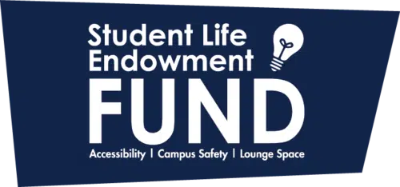
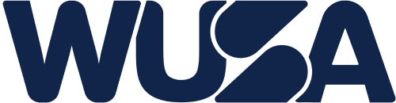




What is the University of Waterloo Debate Society (aka UW Debate)?


We are Waterloo’s competitive debating society, established in 2006!

We regularly compete in tournaments across Canada and the globe (we [traveled to Vietnam](https://www.youtube.com/watch?v=qqoJs9QQuik) for WUDC this year). As a member of CUSID (the Canadian University Society for Intercollegiate Debate), we also annually host a high school tournament (Waterloo HST) and university tournament (Seagram’s IV).

Besides this, we try to have a great time! We go to Subway to grab food after meetings every Wednesday, travel across Canada, and [upload vlogs](https://www.youtube.com/@uwdebate) documenting our tournament adventures. 

We host meetings at 6:30 p.m. every Wednesday in RCH 110.

Again, we’re a **super beginner-friendly club** -- just pop by a Wednesday meeting to judge, debate, or just spectate! If you want to debate/judge at a tournament, or help us organize a Waterloo tournament, just reach out and we’ll likely have a spot for you :)

## Our Funding


  
  
  


## Organizations

  
  
  


  

    
About This Site

    This site, powered by Hugo and Blowfish, was built by Alex Zhu, Advait Sangle, and Nyx Kucharski in Winter 2024.

